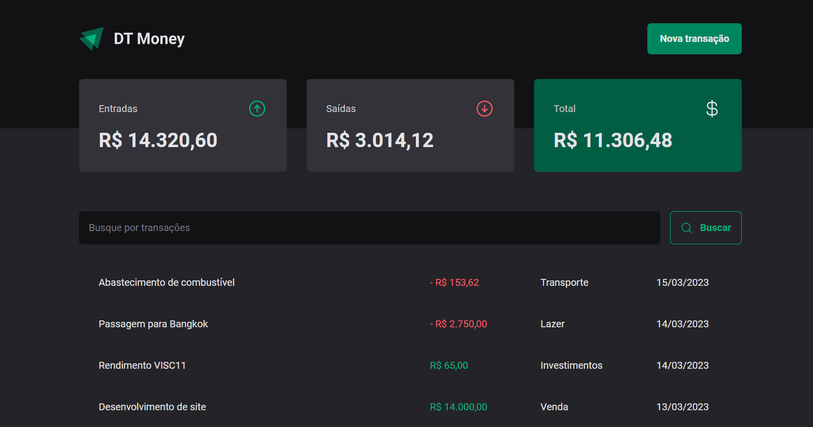

## 💻 Sobre o projeto

DT Money - O dt-money é uma aplicação de controle financeiro que permite cadastrar suas receitas e despesas, fornecendo um saldo total atualizado. Além disso, oferece a funcionalidade de buscar transações por categorias.



## ⚙️ Funcionalidades

- Cadastro de transações de receita e despesa
- Listagem das transações com saldo atualizado
- Filtragem de transações por categoria
     
## 🚀 Como executar o projeto

```bash
# Clone este repositório
$ git clone https://github.com/vanor-cardozo/dt-money.git

# Instale as dependências
$ npm install

# Execute a aplicação em modo de desenvolvimento
$ npm run start

# O servidor iniciará na porta:3333 - http://localhost:3333 
# A aplicação será aberta em uma porta indicada no terminal
```


## 🛠 Tecnologias
- React + Typescript
- Styled Components
- React Hook Form
- Radix UI
- Zod
- JSON Server
- Axios

Além das tecnologias mencionadas, foram aplicados os seguintes conceitos fundamentais:
 - Context API: Utilizada para compartilhar estados globais entre os componentes da aplicação, facilitando a comunicação entre eles.
 - reduce e useMemo: Utilizados para aprimorar a performance da aplicação, reduzindo cálculos desnecessários e otimizando o renderização dos componentes.
  
---

<p align="center">
    
</p>
